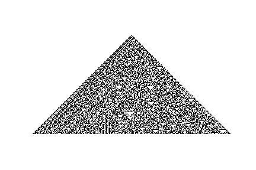
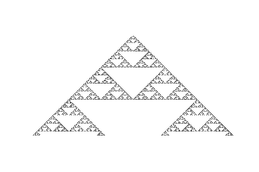
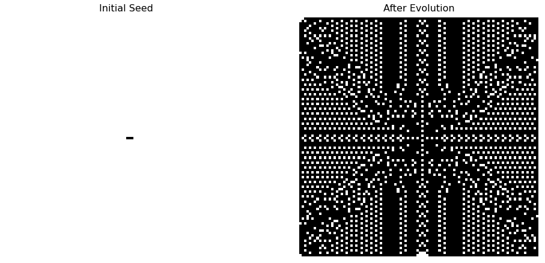
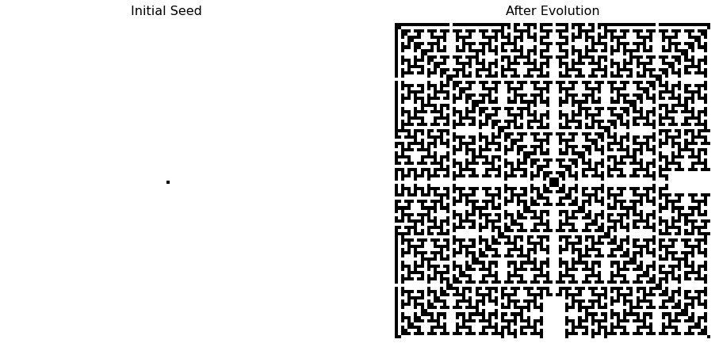

# Cellular-Automata

Cellular Automata is a discrete that can create complex behaviours by using simple rules. The cellular automata is constructed on a grid with a finite number of states with a deterministic rule for evolution, the suprising fact is that by using a deterministic rule there can be complex behaviour that we could not forseen just by looking on the rule. This model was developed by remarkable people such as Von Neumann, Ulam, Bariccelli. I had contact with this model by the Stephen Wolfram's book [A new kind of sciene](https://www.wolframscience.com/nks/). Which is a remakable, but controversial, book that fascineted me when I was starting on physics on the 2010s. 

I will show some remarkable things about cellular automatas on this repository. Hope you all enjoy!

# Notebooks

In the notebook I show some implementations of CAs:

- `Cellular_Automata.ipynb`: In this notebook I show the Elementary Cellular Automata using rules by wolfram. Here are some examples:

<figure align="center">
  
  <figcaption>Rule 30</figcaption>
</figure>

<figure align="center">
  
  <figcaption>Rule 90, which shows a Sierpinsky Triangle</figcaption>
</figure>

- `2D Cellular Automata.ipynb`: In this notebook I show some examples of 2D Cellular Automata for severous types of neighborhoods. Here are some examples:

<figure align="center">
  
</figure>

<figure align="center">
  
</figure>